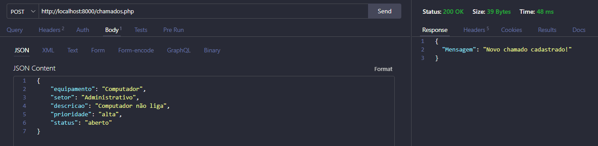
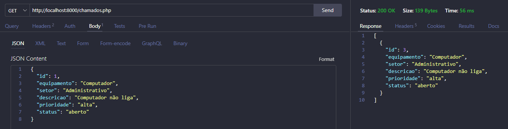
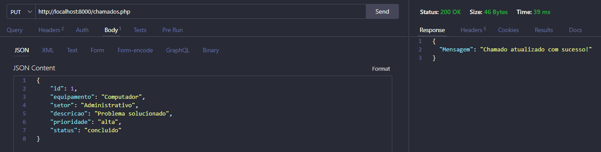
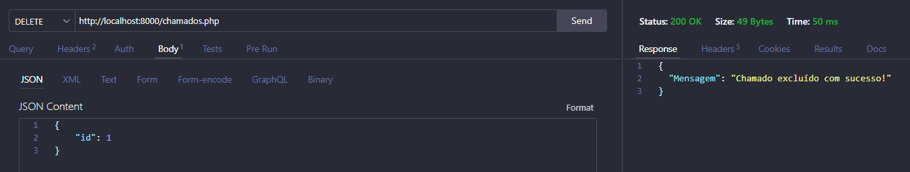

# Atividade 09 - Criação de API REST (GET, POST, PUT, DELETE) com SQL

## Projeto – API para Controle de Chamados de Manutenção

Este projeto foi desenvolvido para criar uma API REST em PHP para o controle de chamados de manutenção de uma empresa.

A API permite cadastrar, consultar, atualizar e excluir chamados utilizando os métodos HTTP GET, POST, PUT e DELETE.

Os dados são armazenados em um banco de dados SQL e as informações são recebidas e retornadas no formato JSON.

---

## Objetivo

Desenvolver uma API capaz de gerenciar chamados de manutenção, facilitando o registro e o acompanhamento dos problemas informados pela empresa.

A API implementa as quatro operações básicas de um CRUD:

- POST – Cadastrar um chamado
- GET – Listar os chamados
- PUT – Atualizar um chamado
- DELETE – Excluir um chamado

---

## Tecnologias utilizadas

- PHP
- PostgreSQL
- SQL
- PDO
- JSON
- HTTP
- API REST

---

## Banco de dados

Foi criada uma tabela para armazenar os chamados de manutenção.

### Tabela: `chamados`

| Campo | Descrição |
|---|---|
| `id` | Identificador do chamado |
| `equipamento` | Equipamento relacionado ao problema |
| `setor` | Setor onde o problema ocorreu |
| `descricao` | Descrição do problema |
| `prioridade` | Prioridade do chamado |
| `status` | Situação atual do chamado |

O campo `id` é a chave primária e possui incremento automático.

### Valores permitidos

**Prioridade:**

- baixa
- media
- alta

**Status:**

- aberto
- em andamento
- concluido

---

# Execuções HTTP

## 1. POST – Cadastrar chamado

O método `POST` é utilizado para cadastrar um novo chamado de manutenção.

### Requisição

```http
POST /chamados.php
```

### JSON enviado

```json
{
    "equipamento": "Computador",
    "setor": "Administrativo",
    "descricao": "Computador não liga",
    "prioridade": "alta",
    "status": "aberto"
}
```

### Print da execução



### Resposta

```json
{
    "Mensagem": "Novo chamado cadastrado com sucesso!"
}
```

---

## 2. GET – Listar chamados

O método `GET` é utilizado para consultar todos os chamados cadastrados no banco de dados.

### Requisição

```http
GET /chamados.php
```

### Print da execução



### Exemplo de resposta

```json
[
    {
        "id": 3,
        "equipamento": "Computador",
        "setor": "Administrativo",
        "descricao": "Computador não liga",
        "prioridade": "alta",
        "status": "aberto"
    }
]
```

---

## 3. PUT – Atualizar chamado

O método `PUT` é utilizado para atualizar as informações de um chamado existente através do seu `id`.

### Requisição

```http
PUT /chamados.php
```

### JSON enviado

```json
{
    "id": 1,
    "equipamento": "Computador",
    "setor": "Administrativo",
    "descricao": "Problema solucionado",
    "prioridade": "alta",
    "status": "concluido"
}
```

### Print da execução



### Resposta

```json
{
    "Mensagem": "Chamado atualizado com sucesso!"
}
```

---

## 4. DELETE – Excluir chamado

O método `DELETE` é utilizado para excluir um chamado através do seu `id`.

### Requisição

```http
DELETE /chamados.php
```

### JSON enviado

```json
{
    "id": 1
}
```

### Print da execução



### Resposta

```json
{
    "Mensagem": "Chamado excluído com sucesso!"
}
```

---

# Resumo das operações

| Método | Operação | Função |
|---|---|---|
| POST | Create | Cadastrar chamado |
| GET | Read | Listar chamados |
| PUT | Update | Atualizar chamado |
| DELETE | Delete | Excluir chamado |

---

## Funcionamento do CRUD

A API utiliza as quatro operações básicas de um CRUD:

**Create → Read → Update → Delete**

- **Create:** cadastro de novos chamados através do POST.
- **Read:** consulta dos chamados através do GET.
- **Update:** atualização dos chamados através do PUT.
- **Delete:** exclusão dos chamados através do DELETE.

---

## Conclusão

A atividade permitiu desenvolver uma API REST em PHP integrada a um banco de dados SQL, utilizando PDO e JSON.

Foram implementados os métodos GET, POST, PUT e DELETE, permitindo realizar as operações necessárias para o gerenciamento dos chamados de manutenção.